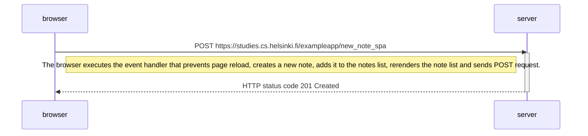

```mermaid
sequenceDiagram
    participant browser
    participant server

    browser->>server: POST https://studies.cs.helsinki.fi/exampleapp/new_note_spa
    activate server

    Note right of browser: The browser executes the event handler that prevents page reload, creates a new note, adds it to the notes list, rerenders the note list and sends POST request.
    
    server-->>browser: HTTP status code 201 Created
    deactivate server
```
